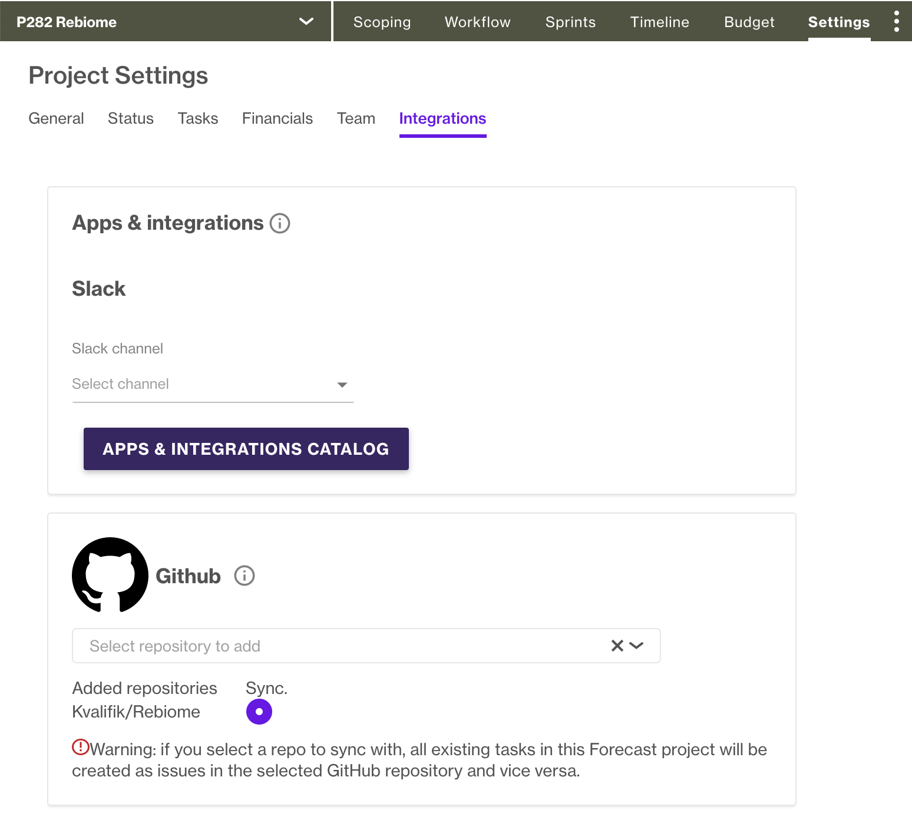
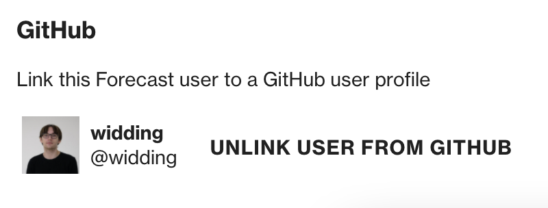

# How we use Forecast when developing

All of our projects are managed through [Forecast](https://app.forecast.it). In here, all tasks related to a project are managed via Kanban boards.

We strive to have each task correspond to one (and only one) feature and git branch.

To aid this, we use Forecast's GitHub integration and [Kvalifik-CLI](https://github.com/Kvalifik/Kvalifik-CLI) to automatically fetch tasks from Forecast and generate corresponding branches/PRs.

## Setup and requirements

Forecast does not automatically integrate with GitHub, so there is a bit of setup needed.

- You must have Kvalifik-CLI installed via: `npm install -g kvalifik-cli` 
  For details, see [Kvalifik-CLI repository](https://github.com/Kvalifik/Kvalifik-CLI) or `kvalifik-cli help`
- The project should be integrated with a GitHub Repository 
  See 'Setup: GitHub Project integration'.
- Your Forecast profile should be linked to GitHub 
  see 'Setup: GitHub Linked Profile'

### Setup: GitHub Project integration

All Forecast projects that involve code need to have a linked GitHub repository.

The GitHub integration is a 2-way sync of Forecast tasks with GitHub issues. This means that every task in Forecast exists as an issue on the linked repository. Assignees\*, labels, descriptions, comments and milestones/phases are also synchronised.

The integration is set up per project.

Go to 'Settings' -> 'Integrations' and scroll down to select a repository.

Please only select 1 repository, even if Forecast lets you select multiple. It is currently **impossible** to synchronise 1 project with multiple repositories. For Forecast projects that require multiple repositories, refer to the [Kvalifik-CLI documentation](https://github.com/Kvalifik/kvalifik-cli#kvalifik-cli-work-on) for our workaround.

> \*Requires a linked GitHub profile. See below for how to set this up.

### Setup: GitHub Linked profile

All Forecast profiles should be integrated with GitHub, so task assignments are synchronised correctly between Forecast and GitHub.

To link your GitHub account to Forecast, go to ['My Profile'](https://app.forecast.it/my-profile/profile) and scroll down to the bottom. When successfully linked, it should look like this:

Now, every time you are assigned to a task in Forecast, you will also be assigned to the issue in GitHub. This lets you easily filter between issues when working in larger teams. Kvalifik-CLI has a handy '-a' flag on the 'work-on' command that only shows issues assigned to you: `kvalifik w -a`

## Usage

In practice, the Forecast/GitHub Integration handles most of the work. Every time a task is added to a project, it automatically becomes an issue in the linked GitHub repository. The issue will also react accordingly to any changes made to the task.

To begin working on a task, clone the repository, write `kvalifik w` in your terminal and select the task from the list. This sets up a branch and draft pull request that is linked to the issue.

> At this point, you might need to manually move the task in Forecast into 'In Progress' to let your teammates know that you have picked up the task.

When your code is ready for review, you can write `kvalifik rr` and the CLI marks the pull request as 'Ready for Review'. Make sure to request a review!

> If your project has a column called 'Ready for Review', 'Code Review', 'Awaiting Approval' or similar, you should move the task into it; this will make everyone _not_ on GitHub aware of what is going on as well.

Once your PR has been approved (after code-review), then you can merge the PR. This will automatically result in the corresponding issue on GitHub being closed which automatically moves the corresponding task in Forecast to the closest 'Done' column.
